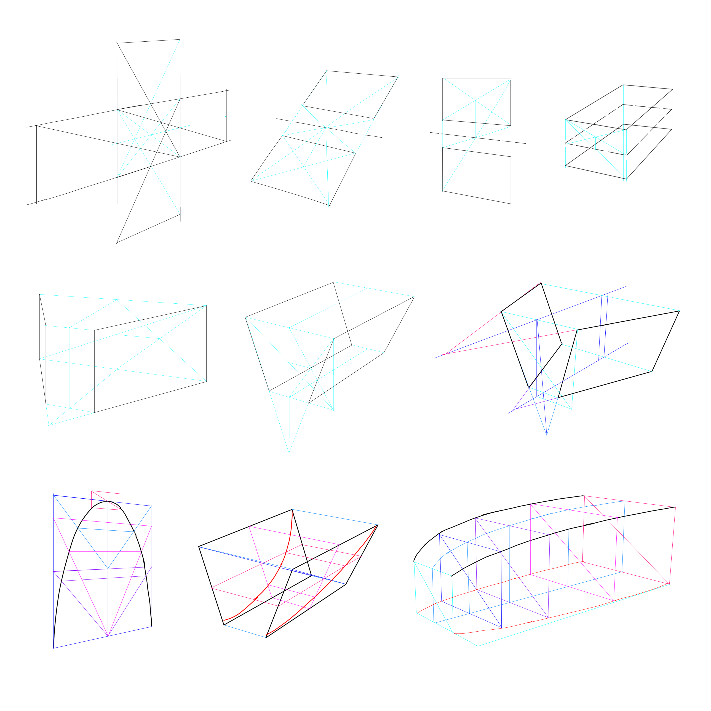

h2d03_persp.md

How to Draw: Chapter 03 Perspective Drawing Techniques
================================================================================

A~0e20

3.1 Division and Multiplication of Dimensions in Perspective
--------------------------------------------------------------------------------

### Dividing a Rectangle in Half, in Perspective

1. define the rectangle
2. draw the 2 diagonals, get the center
3. draw vertical or horizontal line through center, lines should follow perspective grid  
   in persp view, the distance between closer 2 lines is wider than further ones, this is called *foreshortening*
4. divide further into 1/4, 1/16...

### Duplicating a Rectangle, in Perspective

1. define the rectangle and direction to multiply toward
2. find midpoint of multiplication axis (by diagonals or estimating the halfway point when dividing line is horizontal or vertical)
3. draw a diagonal that connects the far corner of initial rectangle through the midpoint until crosses extended line
4. draw a parallel line from intersection to find the boundary of duplicated rectangle

- tip: choose shorter diagonal to draw, as it isprecise with hand draw
- watch out when making corrections, avoid adding multiple lines to find the right one, just draw one line and correct it by making an educated guess as to where the actual subdivision line should be, this will produce cleaner drawings and be faster

3.2 Dividing into Odd-Numbered Proportions
--------------------------------------------------------------------------------

1. define the plane
2. draw a line parallel to HL, starting at front edge of plane; devide the line into serval equal segments
3. connect last subdivision point to end of plane and continue the line to HL
4. draw parallel lines in perspective from each segment point to VP
5. draw vertical lines at each of intersection points to transfer subdivisions

--------------------------------------------------------------------------------

- 3.3 Mirroring in Perspective
  - Mirroring Horizontal Planes
  - Mirroring Vertical Planes
  - Mirroring Offset Planes
- 3.4 Mirroring Tilted Planes
- 3.5 Mirroring Rotated, Tilted Planes
- 3.6 Mirroring 2D Curves
- 3.7 Mirroring a 2D Curve on a Tilted Surface
- 3.8 Mirroring 3D Curves in Perspective: The 2-Curve Combo

--------------------------------------------------------------------------------

--------------------------------------------------------------------------------

EOF
