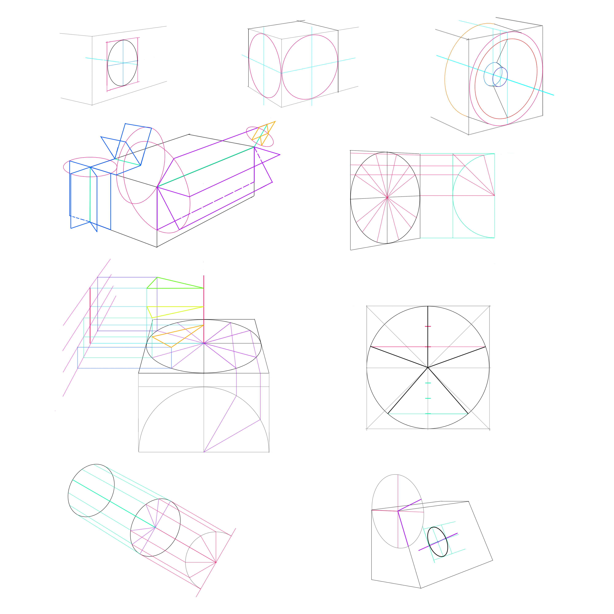

h2d05_ellipse.md

How to Draw: Chapter 05 Ellipses and Rotations
================================================================================

A~0e30

Drawing ellipses is the basis for hinging flaps, ratating objects, constructing spiral staircases, and generate grids with squares in any direction.

5.1 Ellipse Basics and Terminology
--------------------------------------------------------------------------------

- minor axis
  - always intersects center of circumscribed square
  - always perpendicular to ellipse's surface
- ignore major axis
- ellipse degree: measure of angle of line of sight into surface of ellipse

5.2 Placing a Circle in Perspective or Drawing Ellipse
--------------------------------------------------------------------------------

1. define a vertical surface upon which to draw the circle in perspective; draw a line perpendicular to the surface to define minor axis direction
2. draw an ellipse and estimate degree of ellipse, then draw a bounding box (to test if correct the degree is)
3. correct ellipse need to fulfill:
   - touch left vertical line halfway
   - touch upper and lower line at points vertically aligned
   - touch closing vertical line at halfway point as well
4. try to find the correct ellipse meeting all conditions

5.3 Creating a Cube Using Ellipse
--------------------------------------------------------------------------------

Creating cubes in perspective is very useful for both creating grids and controling proportions of objects in perspective.

1. define height and front corner of cube over a perspective grid, this establishes minor axis VP
2. place an ellipse on each side, tangent to corner
3. add vertical lines tangent to ellipse to define the proportions of a cube

5.4 Offsetting Ellipses
--------------------------------------------------------------------------------

Modify size of ellipse while keeping degree unchanged, if the ellipses are kept rather close together along minor axis.  
When moving far along minor axis into deeper perspective, change degree;  
just redraw a defining prespective square to double-check the degree

5.5 Hinging and Rotating Flaps and Doors
--------------------------------------------------------------------------------

Minor axis is the hinge in drawing;  
Ellipse is path of points rotated.

5.6 Subdividing Ellipses
--------------------------------------------------------------------------------

1. set up ellipse in perspective; take vertical height of ellipse and extend to side and close with a half-circle
2. add subdivisions starting at center of semi-circle using a protractor
3. draw horizontal, parallel lines through intersection points of circle over to vertical line of ellipse, extend lines to perspective
4. connect intersetion points to center of ellipse

### Spirals

1. subdivide ellipse on the ground
2. preparet to lift the stairs
   1. mark height of steps in center of staircase
   2. then transfer the height to side, out of the way of construction
   3. draw a vertical line, mark intersection points
   4. extend transferred height into perspective, add parallel lines that converge to VP
3. build steps
   1. draw 2 vertical on ellipse intersection points
   2. draw 2 horizontal until intersect the side height scale
   3. draw vertical up to next height line
   4. draw back horizontal to stair verticals and define correct height of step
   5. connect intersection points to center

5.7 Shortcuts to Dividing Ellipse
--------------------------------------------------------------------------------

- 5-spoke wheel construction subdivision
  1. divide upper half of a vertical centerline into thirds, lower half into quarters
  2. draw horizontals in perspective through lower third point of upper half, and lower quarter of lower half
  3. the intersection points with ellipse provide endpoints of spokes
- tread subdivision cheat
  1. extend minor axis with a parallel construction
  2. subdivide from there instead of using vertical line
  3. (it is not technically correct, but efficient)

5.8 Placing a Circle on a Sloped Surface
--------------------------------------------------------------------------------

1. determine minor axis
   1. draw a ellipse around an edge of sloped surface
   2. quarter the ellipse
   3. observe how much the sloped surface angle has rotated from vertical, estimate same amount of rotation to horizontal
2. draw a light ellipse around minor axis, estimate degree
3. to check the degree, draw 3 sides of a bounding box, matching perspective grid of sloped surface

--------------------------------------------------------------------------------

--------------------------------------------------------------------------------

EOF
