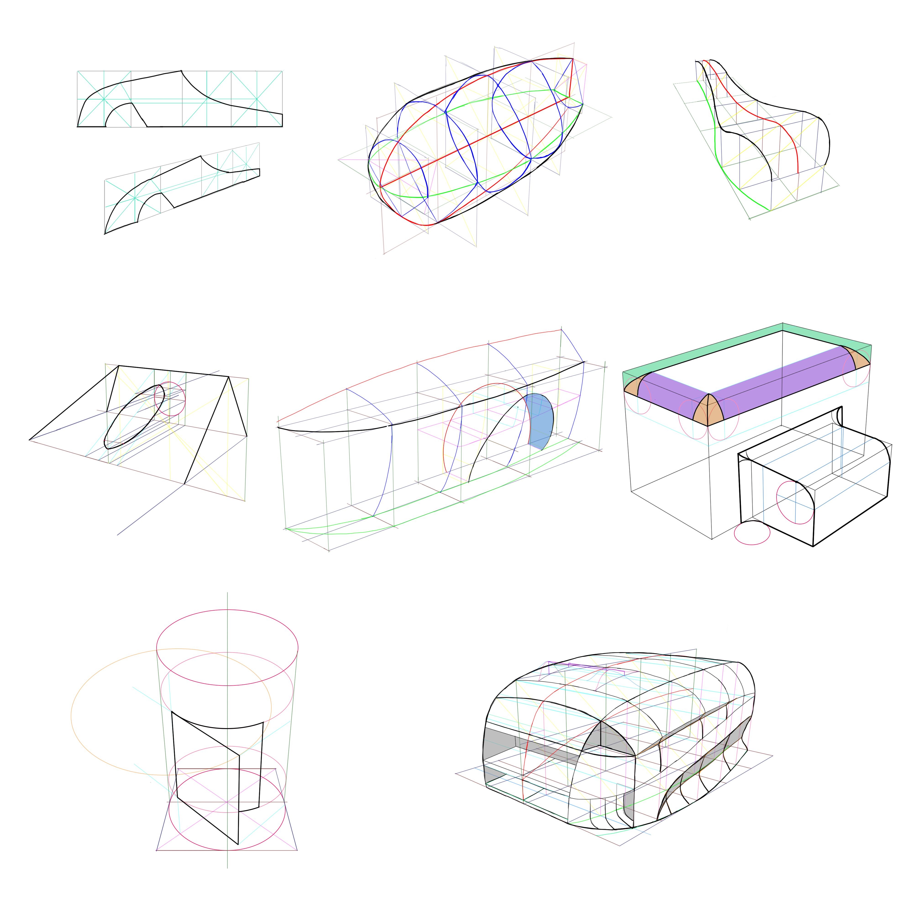

h2d06_volume.md

How to Draw: Chapter 06 Working with Volume
================================================================================

A~0f05

At the center of accurately drawing volumes in perspective is an understanding of "drafting" which is the skill of drawing the same object from multiple views without any perspective convergence.

6.1 Panning Before Perspective
--------------------------------------------------------------------------------

It is a good idea to develop a plan by sketching several simpler views before jumping into elaborate perspective construction drawings.

6.2 Orthographic Views, aka Orthogonal Views or Draft Views
--------------------------------------------------------------------------------

Orthographic views of an object are seen from only one side without any perspective convergence;  
also called draft views, orthos, orthogonal views.

6.3 Transferring a Side View into Perspective
--------------------------------------------------------------------------------

1. create a bounding rectangle that can be divided evenly into squares, within rectangle draw a shape in side view;
   - conversely, draw shape then rectangle, make sure rect divided evenly into squares
2. add more lines to create more intersection points
   - try extending shorter sections of shape to see where to intersect bounding rect (these helps when lightly added to the perspective planes and then used to sketch in finished sections)
3. create a bounding rect in persp with same proportions as side view
4. look for alignments and intersection points on the draft view that correspond to similar points on the persp view; look for intersections where shape's lines cross lines of persp grid rects

6.4 Putting It All Together: X-Y-Z Section Drawing
--------------------------------------------------------------------------------

1. start with a Y plane to define the centerline of the form
2. define a flat plane that the volume will be sitting on by adding some persp guidelines going to LVP; locate guidelines at intersection of vertical guidelines and bottom of centerline; determine the width of the top view by adding guidelines going to RVP; draw top view on Z plane
3. mirror top view to the far side of Z plane
4. sketch a line of the mirrored top view through ref points
5. add X sections at any of the section loactions defined by persp guidelines crossing Y and Z planes; they can be sketched on either side of centerline; just sketch one half for now
6. add and mirror remaining X sections
7. the X-Y-Z shape comes together with the drawing of silhouette line

6.5 Extending the Sections
--------------------------------------------------------------------------------

6.6 2-Curve Combo
6.7 Cutting Volumes
6.8 Adding Radii and Fillets
6.9 Wrapping Graphics
6.10 Detailing and Sculpting Surfaces
6.11 More Tips for Modifying Complex Volumes
6.12 Contour Lines, Overlapping and Line Weight
6.13 X-Y-Z Section Drawing Applied

--------------------------------------------------------------------------------

